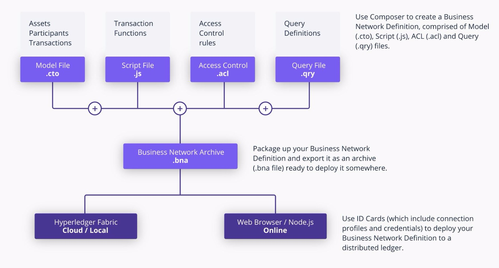

# Project-Team-6

### Team Members
* Tarun Arora
* Effendy Kumala
* Sricheta Ruj
* Abhin Sharma

## Project : AutoChain - Built on Blockchain
 
As the connected devices proliferate everywhere and the advent of autonomous vehicles are closer and closer, blockchain technology has the potential to support the safe and reliable autonomous vehicles. Blockchain will function as automobile foolproof bookkeeper, such as logging the mileage, repair/service records, and trips data. Other benefits include enabling more transparent true value of the automobile, allowing improved insurance rate, supporting car sharing/lease business.
 
**Technology Used** – Blockchain API, Smart Contract, Connected Devices, React JS, Mongo DB , Node JS and Express JS

## Architecture diagram of BLockchain network used

## Problems Addressed

* (Non) Public Data
* Scattered historical data with limited access or information
* International data loss or absence of synced regulations between countries
* No ability to share data between centralized databases
* Used car owners and buyers are not aware of the full history of the car

## Who are the users?

* Common people - John (a teacher) looking to check the authenticity of his new first car
* Manufacturer - Michael from Honda product handling dept.  adding manufactured cars to the blockchain 
* Third Party Integration - Jacob from AutoTrader integration our API to their database for increased reliability

## Business Model

* API access to Insurance companies, Rental car companies and Marketplaces.
* Pro(paid) features like notification for  insurance renewal, maintenance checkup, service notification.
* b2b monthly fee + for a quantity of API calls.
